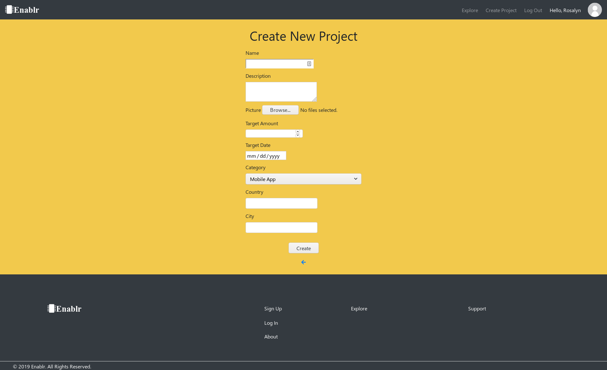
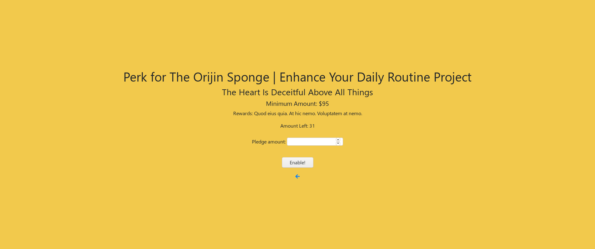
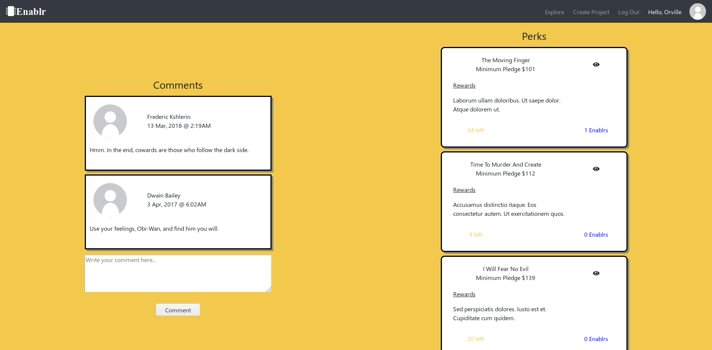
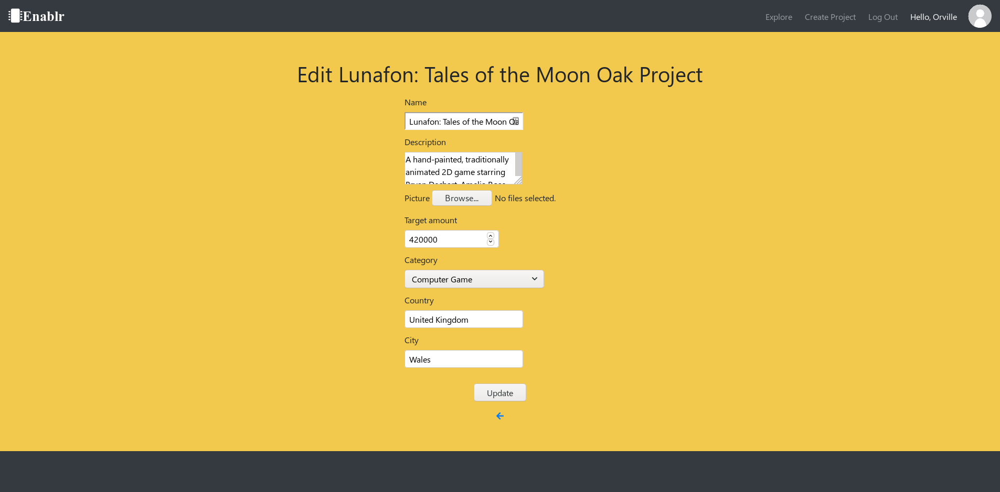

# Enablr

[Heroku](https://enablr.herokuapp.com/)<br>
[GitHub](https://github.com/en3on/enablr)

Enablr was created to allow for an easy way to get your startup funded by the public, in exchange for different 'Perks' that they can receive. Users can sign up as either a standard user or a fundraiser. **Fundraisers** can both create and enable projects, whereas **standard** users can only enable.


#### Features
We offer the following features to users of Enablr:

* **Sign up** for a free account as either a **Standard** user or a **Fundraiser**

* **Create projects** as a fundraiser

* **Enable** other's projects by pledging a chosen amount to a specific **perk**

* **Comment** on any project that they have enabled

* **Upload multiple pictures** for their project<br>

* **Edit / Delete** their own: 
    * Comments
    * Projects
    * Perks
    * Profile
    * Pictures

* **Request a refund** for their pledge, provided that the purchase was made _less than 30 days ago_


## Getting Started
These instructions will get you a copy of the project up and running on your local machine for development and testing purposes. See deployment for notes on how to deploy the project on a live system.

### Prerequisites
In order to run this app, the following software is needed

[PostgreSQL](https://postgresql.org/download) is needed for the database<br>
[Ruby](https://www.ruby-lang.org/) is needed in order to compile the app<br>
Rails is used as the framework, and needs to be installed as a gem<br>
```
gem install rails
```

## Deployment
To run this app on your system, first create the database by running the following command: 

```
rails db:create
```

Migrate the changes to the database:

```
rails db:migrate
```

Optionally, seed the database with the provided seed file:

```
rails db:seed
```

To start up the server, run the following command:
```
rails server
```

And then navigate to ```http://localhost:3000```

## Build With
Enablr was created using the following technology:

* Ruby _2.5.1_ - _Language_
* Rails _5.2.3_ - _Web Framework_
* HTML _5_ - _Language_
* CSS _3_ - _Language_
* PostgreSQL - _Database_
* SASSC - _Language_
* CoffeeScript - _Language_
* Bootstrap - _Gem_
* Jquery - _Language_
* CanCanCan - _Authorization Gem_
* Devise - _Authentication Gem_
* FactoryBot - _Gem for easily creating instances of models for testing/ seeding_
* Faker - _Gem for randomly generating data_
* Amazon Web Services - _Storage services_
* Heroku - _App Deployment_

## Authors
* Adam Ladell
* Ryan Rico

## Requirements - Short Answer Questions

1. What is the need (i.e. challenge) that you will be addressing in your project?

To give Tech Startups a platform to easily reach a community of potential customers/investors to fund their company.

2. Identify the problem you’re trying to solve by building this particular marketplace App? Why is it a problem that needs solving?
    
    The problem we are trying to solve is giving tech startups access to funding from potential investors. It is a problem that needs solving because on similar websites like kickstarter there are a ton of categories with thousands of projects in each category which can make it hard for tech projects to get any exposure. By limiting it to tech startups we can categorise projects into specific kinds of technologies.

3. Describe the project you will be conducting and how your App will address the needs.

    The project we will be conducting is creating a Crowdfunding platform specifically for Hardware/Software Tech Startups. Our app will address the needs because it is limited to crowdfunding for tech startups.
  
4. Describe the network infrastructure the App may be based on.
  
  Our app would require a database server to handle storing the data of the users. We would also need a cloud server running to handle the requests of users.
  The infrastructure we would use, would be in line with a Dynamic setup.

5. Identify and describe the software to be used in your App.

    The software to be used in our App is Ruby and Ruby on Rails as well as JavaScript.

6. Identify the database to be used in your App and provide a justification for your choice.

    The database to be used in our app is PostgreSQL. The justification for our choice is that it is compatible with Heroku deployment.

7. Identify and describe the production database setup (i.e. postgres instance).

  Our database consists of the following tables;
    - Active Storage Attachments
    - Active Storage Blobs
    - Comments
    - Perks
    - Project Enablrs
    - Projects
    - Users

    Users can enable a project, and can also create projects if they are flagged as fundraisers

    Project Enablrs are created upon the successful enabling of a project's perk

    Project Enablrs can create comments

8. Describe the architecture of your App.

  Our app was build on Test-Driven-Development allowing for easy scalability, as we are able to make increase the depth of our web app with confidence in knowing that the app still performs its intended function.

  We utilise a layered architecture with the seperation of functions/ views depending on the action being performed or the user that is performing it.

  We employ a system of collaboration using a user-to-user foundation.

9.  Explain the different high-level components (abstractions) in your App.

  We allow users to create their own projects, specifying the target amount, target date and project information. The project creator is presented with the opportunity to edit their project at any time as well as see the statistics of their project.

  Projects can employ a range of photos.

  Project Creators can edit/delete perks as long as no one has enabled them

  Project Creators can delete their project at any time

  We allow user to 'enable' projects (pledge a monetary amount to the project) via redeeming a specific perk based on the amount that they pledge.

  Users can add a profile picture for personalization needs as well as edit other aspects of their profile.

  Users can explore the range of projects on the site.

  Users can request a refund, provided that the purchase was made less than 30 days ago.

  Users can create comments on projects that they have enabled, as well as edit/delete their comments.

  Users' comments are sorted from the most recent to oldest.

10.  Detail any third party services that your App will use.

  Our app uses Mailer to handle sending the user notifications about actions taken on their account.

  It also uses Stripe to manage user payments.

11. Describe (in general terms) the data structure of marketplace apps that are similar to your own (e.g. eBay, Airbnb).

    The data structure of marketplace apps that are similar to our own is Kickstarter. 

12. Discuss the database relations to be implemented.

Enabler
Has many comments
Belongs to User
Belongs to Project
Belongs to Perk

Perk
Has many enablers
Belongs to Project

Project
Has many enablers
Has many perks
Belongs to User

User
Has many enablers
Has many projects

Comments
Belongs to Enablr

13.  Describe your project’s models in terms of the relationships (active record associations) they have with each other.

  Enabler
  Has many comments
  Belongs to User
  Belongs to Project
  Belongs to Perk

  Perk
  Has many enablers
  Belongs to Project

  Project
  Has many enablers
  Has many perks
  Belongs to User

  User
  Has many enablers
  Has many projects

  Comments
  Belongs to Enablr

14.  Provide your database schema design.<br>
[ERD](https://dbdesigner.page.link/vrALugAC9QMVC94W6)
```
  create_table "active_storage_attachments", force: :cascade do |t|
    t.string "name", null: false
    t.string "record_type", null: false
    t.bigint "record_id", null: false
    t.bigint "blob_id", null: false
    t.datetime "created_at", null: false
    t.index ["blob_id"], name: "index_active_storage_attachments_on_blob_id"
    t.index ["record_type", "record_id", "name", "blob_id"], name: "index_active_storage_attachments_uniqueness", unique: true
  end

  create_table "active_storage_blobs", force: :cascade do |t|
    t.string "key", null: false
    t.string "filename", null: false
    t.string "content_type"
    t.text "metadata"
    t.bigint "byte_size", null: false
    t.string "checksum", null: false
    t.datetime "created_at", null: false
    t.index ["key"], name: "index_active_storage_blobs_on_key", unique: true
  end

  create_table "comments", force: :cascade do |t|
    t.string "content"
    t.datetime "created_at", null: false
    t.datetime "updated_at", null: false
    t.bigint "project_enablr_id"
    t.bigint "project_id"
    t.index ["project_enablr_id"], name: "index_comments_on_project_enablr_id"
    t.index ["project_id"], name: "index_comments_on_project_id"
  end

  create_table "perks", force: :cascade do |t|
    t.integer "minimum_amount", null: false
    t.boolean "unlimited", null: false
    t.integer "enablr_amount", null: false
    t.datetime "created_at", null: false
    t.datetime "updated_at", null: false
    t.bigint "project_id"
    t.integer "amount_left"
    t.string "name"
    t.string "rewards"
    t.datetime "estimated_delivery"
    t.boolean "not_deliverable"
    t.index ["project_id"], name: "index_perks_on_project_id"
  end

  create_table "project_enablrs", force: :cascade do |t|
    t.integer "pledged_amount"
    t.datetime "created_at", null: false
    t.datetime "updated_at", null: false
    t.bigint "user_id"
    t.bigint "project_id"
    t.bigint "perk_id"
    t.index ["perk_id"], name: "index_project_enablrs_on_perk_id"
    t.index ["project_id"], name: "index_project_enablrs_on_project_id"
    t.index ["user_id"], name: "index_project_enablrs_on_user_id"
  end

  create_table "projects", force: :cascade do |t|
    t.string "name", null: false
    t.string "description", null: false
    t.boolean "hardware", null: false
    t.integer "current_amount", null: false
    t.integer "target_amount", null: false
    t.datetime "target_date", null: false
    t.string "category", null: false
    t.string "country", null: false
    t.string "city", null: false
    t.integer "backer_amount", null: false
    t.datetime "created_at", null: false
    t.datetime "updated_at", null: false
    t.bigint "user_id"
    t.index ["user_id"], name: "index_projects_on_user_id"
  end

  create_table "users", force: :cascade do |t|
    t.string "email", default: "", null: false
    t.string "encrypted_password", default: "", null: false
    t.string "reset_password_token"
    t.datetime "reset_password_sent_at"
    t.datetime "remember_created_at"
    t.datetime "created_at", null: false
    t.datetime "updated_at", null: false
    t.string "first_name", null: false
    t.string "last_name", null: false
    t.boolean "fundraiser", null: false
    t.string "country", null: false
    t.string "city", null: false
    t.index ["email"], name: "index_users_on_email", unique: true
    t.index ["reset_password_token"], name: "index_users_on_reset_password_token", unique: true
  end

  add_foreign_key "active_storage_attachments", "active_storage_blobs", column: "blob_id"
  add_foreign_key "comments", "project_enablrs"
  add_foreign_key "comments", "projects"
  add_foreign_key "perks", "projects"
  add_foreign_key "project_enablrs", "perks"
  add_foreign_key "project_enablrs", "projects"
  add_foreign_key "project_enablrs", "users"
  add_foreign_key "projects", "users"
```

15.  Provide User stories for your App.<br>
[User Stories](https://app.cardboardit.com/maps/guests/d014540bd3a65f92d4456912a2a6c1f690785c0aa2a4fa050d1b4a185eb595c2)
16.  Provide Wireframes for your App.<br>
[Figma](https://www.figma.com/file/O4XXIT8V1WFtg8Kl5QXLHTaP/Enablr?node-id=0%3A1)
17.  Describe the way tasks are allocated and tracked in your project.

The main way that tasks were allocated and tracked was through the use of the web application Trello. Using Trello, we were able to assign and see the tasks that each person was doing for the day, what they had completed and what tasks still needed to be done. We also set due dates and checklists for tasks to be more efficient and detailed. The use of colour coded labels also made it quicker to identify which aspect of the project the team member was working on at the time. When outside of class, we also communicated via the communication app Slack in case there were any concerns, questions or if we thought about tasks that needed to be added to the Trello page.

18.  Discuss how Agile methodology is being implemented in your project.


We used the following Agile Methodologies:

Pair Programming: During the project, we would sometimes work on one computer. This made it easier for us to pick up on any errors, be more efficient and learn from one another.

Scrum: We had daily standups to discuss what was done the day prior, the tasks that we were working on for the day and if there were any blockers hindering our progress. This helped us reflect on what had been done and what to focus on next.

Workflows: Tasks were broken down into To Do, In Progress and Completed workflows.

Kanban: Tasks broken down into workflows and features were visualised in cards and columns using Trello.

User Stories: Creating user stories to conceptualise features and requirements from the perspective of end-users.

19.  Provide an overview and description of your Source control process.<br>

For Enablr, we used GitHub to manage the source code of our project.
When we had a new feature to work on, or a feature to patch, we would create a new branch and work on that feature in that branch.
We would commit as soon as some small part of our feature worked and would push regularly.
Upon completion of the feature, a pull-request would be created and the other member would approve the request and merge it to master.

20. Provide an overview and description of your Testing process.

For testing, we employed a TDD work flow using RSpec, FactoryBot and Capybara.
Failing tests were created before we implemented the function, to give us an idea of what we had to do next for our project.
We ran tests on models, ensuring that only valid parameters would pass, as well as ensuring that the authorization for roles was working perfectly.
Additionally, we set up some Capybara tests to validate the functionality of the UI.
This method of testing minimized the amount of bugs we ran into and allowed us to focus more on feature development, than bug fixing.

21.  Discuss and analyse requirements related to information system security.

We have used Devise in our app, which securely encrypts and stores our users passwords.
CanCanCan was used to disallow the destruction/ modification of other user's content.
Parameters that are sensitive, were passed using hidden fields in forms, in order to not display it in the URL for safety reasons.

22. Discuss methods you will use to protect information and data.

There are a number of ways we protect our users information and data. The methods we implement to do this are by encrypting the passwords of our users, keeping email addresses private, offering customers a 30 day refund guarantee and using HTTPS for credit card processing. We also used validations such as requiring a 1 lower case letter, 1 upper case letter and 2 numbers to make passwords more secure. 

The following gems used also assisted in protecting information and data. Devise provides authentication for hashing and storing user data. It also adds user registration, log-in and log-out features to our website. Stripe processes payments so that financial data is not stored. Finally Cancancan provides a set of helpers for authorisation to manage user permissions and application policies.

23.  Research what your legal obligations are in relation to handling user data.

The Privacy Act 1988 is an Australian law which regulates the management, storing, access and correction of personal information about individuals. The privacy Act has thirteen principles that businesses covered by the Privacy Act need to follow.

Our legal obligations in relation to handling user data and in accordance with the privacy laws is that we have the responsibility to protect personal information from:

* Theft
* Misuse
* Interference
* Loss
* Unauthorised access
* Modification
* Disclosure

And to take reasonable steps to destroy personal information when it is no longer needed for any purpose under the Privacy Act 1988. Only businesses with an annual turnover of $3 million or more must comply with the Privacy Act 1988. Businesses with an annual turnover of less than $3 million may have responsibilities under the Privacy Act if they are a certain type of business.

From February 2018 there is also a Notifiable Data Breaches scheme that companies need to comply with under the Act if a data breach involves personal information and can cause harm to an individual. The individual and Office of Australian Information Commissioner are to be notified if this happens.


